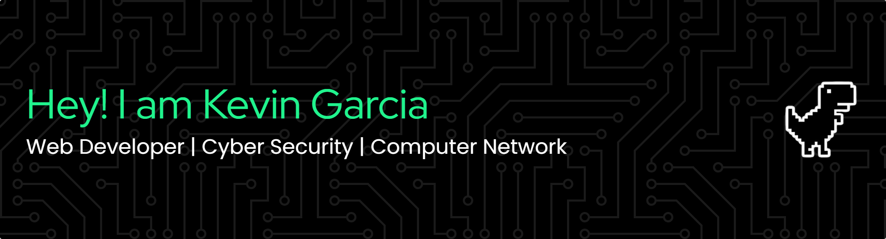

<div align="center">

[](https://linkedin.com/in/k3gar)
[](https://tryhackme.com/p/k3gar4)

</div>

---

## whoami

```bash
$ whoami
> Frontend Developer · Network Engineer · Offensive Security (in progress)
> 4+ years building high-traffic e-commerce platforms (React · TypeScript · VTEX IO)
> Background: network infrastructure, firewalls, virtualization (pfSense · Proxmox · Cisco)
> Currently: Cisco Ethical Hacker cert | Building pentesting lab | Learning Go
> Open to: Frontend, Networking, or Security roles
```

Desarrollador Frontend con experiencia real en e-commerce de alto tráfico y background
sólido en infraestructura de redes. Actualmente en transición activa hacia seguridad
ofensiva — construyendo labs, herramientas y writeups en público.

---

## 🔧 Stack

**Frontend**


**Infrastructure & Networking**


**Offensive Security (building)**


---

## 📂 Proyectos

| Repo | Descripción |
|------|-------------|
| [writeups](https://github.com/k3gar/writeups) | HTB · TryHackMe · VulnHub · Notas |
| [tools](https://github.com/k3gar/tools) | Herramientas |
| [labs](https://github.com/k3gar/labs) | Recopilación de notas sobre mis laboratorios |

---

## 📈 Stats

<p align="left">
  
  
</p>

---

<div align="center">
<sub>Aprendiendo continuamente · Open to work</sub>
</div>
